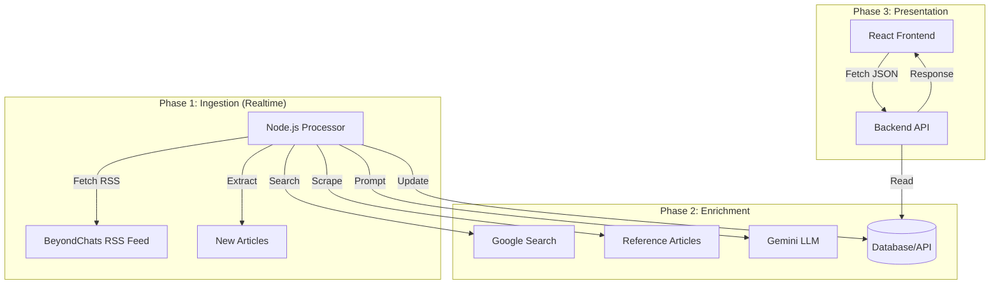

# BeyondChats - Full Stack Article Enrichment System

A monolithic full-stack application that fetches blog articles via RSS, enriches them using Google Search and Gemini LLM, and displays them in a modern React UI.

## 🏗️ Architecture

The system consists of three main components:

1.  **Backend**:
    *   **Production**: Laravel (PHP) managing the PostgreSQL database.
    *   **Local (Fallback)**: Node.js Express server (`backend-node`) for environments without PHP/SQLite drivers.
2.  **Processor (Node.js)**: A background worker that fetches articles via **RSS Feed** (`beyondchats.com/feed`), searches Google for context, and uses AI to rewrite content.
3.  **Frontend (React + Vite)**: Displays the articles in a responsive, glassmorphism-styled UI with clickable cards.

### Data Flow Diagram



## 🚀 Local Setup Instructions

### Prerequisites
-   **Node.js** (v18+) & **npm**

### 1. Clone the Repository
```bash
git clone <your-repo-url>
cd BeyondChats
```

### 2. Backend Setup
**Option A: Node.js Mock Backend (Recommended for Local)**
*Use this if your local PHP environment is missing drivers.*
```bash
cd backend-node
npm install
node server.js
# Runs on http://localhost:8000
```

**Option B: Laravel Backend (Production Standard)**
*Use this if you have PHP and SQLite enabled.*
```bash
cd backend
composer install
cp .env.example .env
php artisan migrate --force
php artisan serve
```

### 3. Processor Setup (Node.js)
Open a new terminal.
```bash
cd processor

# Install dependencies
npm install

# Configuration
cp .env.example .env 
# Edit .env:
# API_URL=http://localhost:8000/api/articles

# Run Processor (Continuous Loop)
node index.js
```

### 4. Frontend Setup (React)
Open a new terminal.
```bash
cd frontend

# Install dependencies
npm install

# Configuration
# Ensure .env exists with:
# VITE_API_BASE_URL=http://localhost:8000/api

# Run Development Server
npm run dev
# Runs on http://localhost:5173
```

## 🧪 Usage
1.  **Auto-Fetch**: The `processor` automatically fetches new articles from the RSS feed every 5 minutes.
2.  **View Data**: Open `http://localhost:5173`. Click any card to read the original source.

## 📂 Project Structure
-   `/backend`: Laravel 11 API (Production)
-   `/backend-node`: Express API (Local Fallback)
-   `/processor`: Node.js RSS Scraper & AI Enricher
-   `/frontend`: React 18 UI
